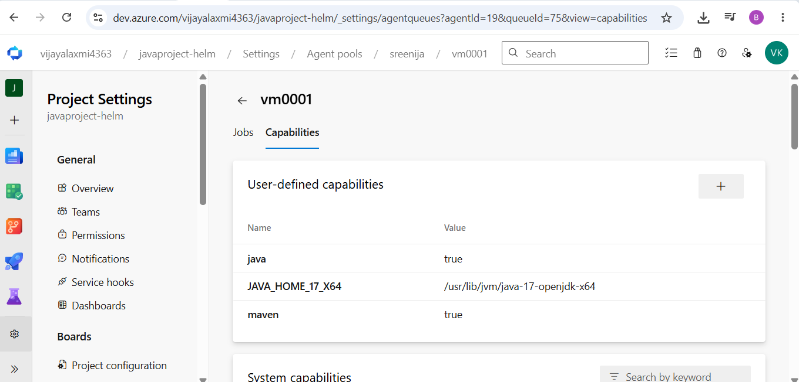
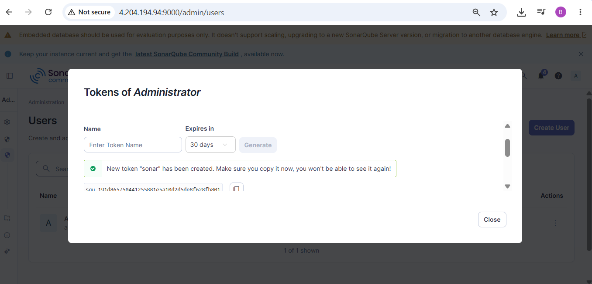
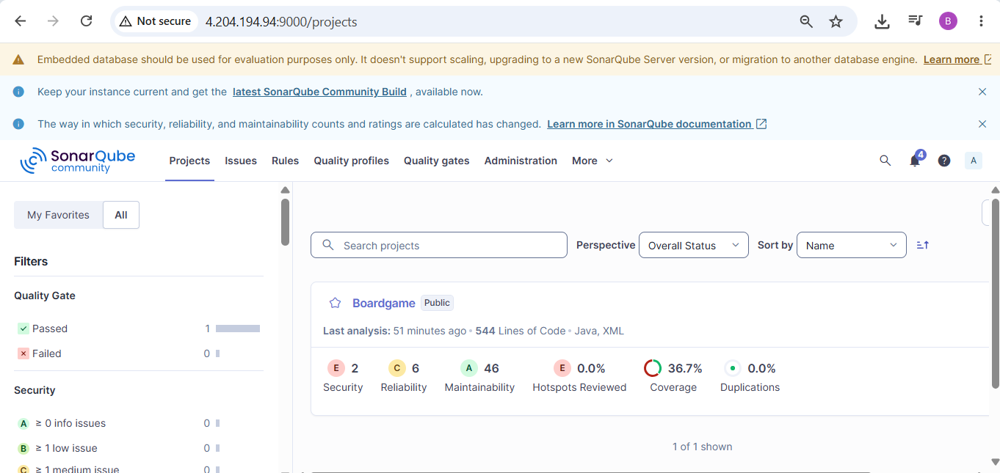
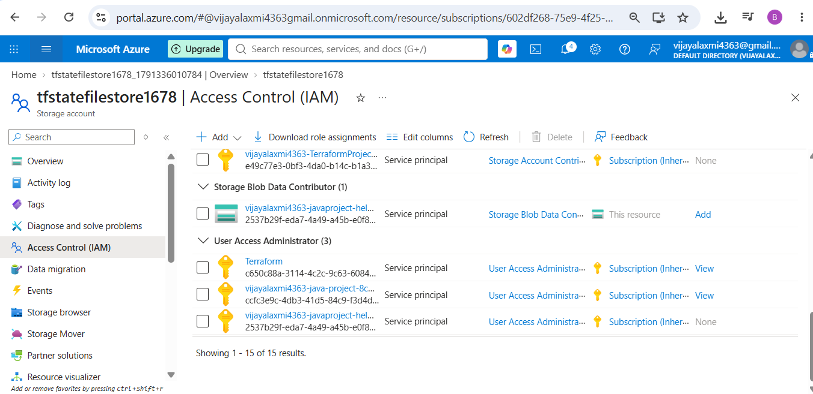
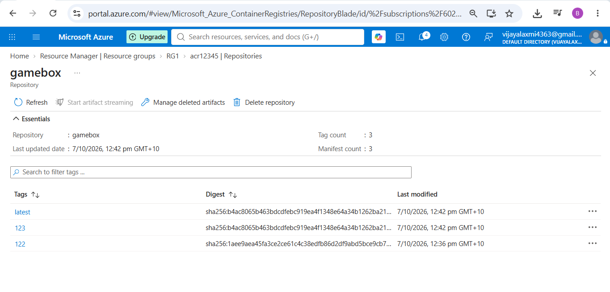
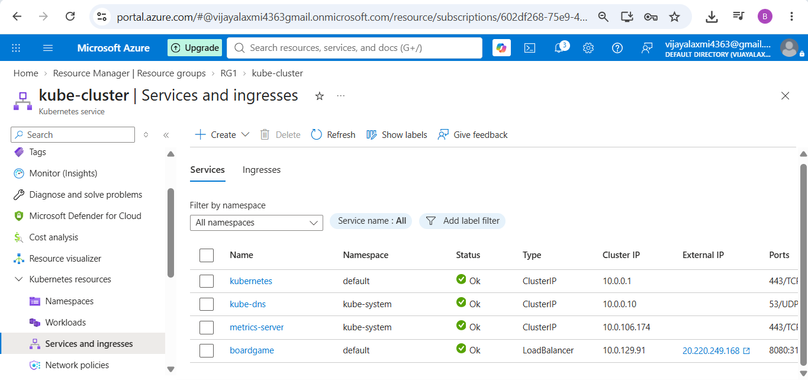
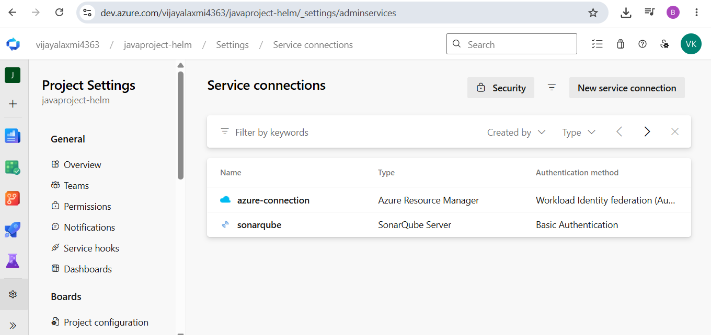
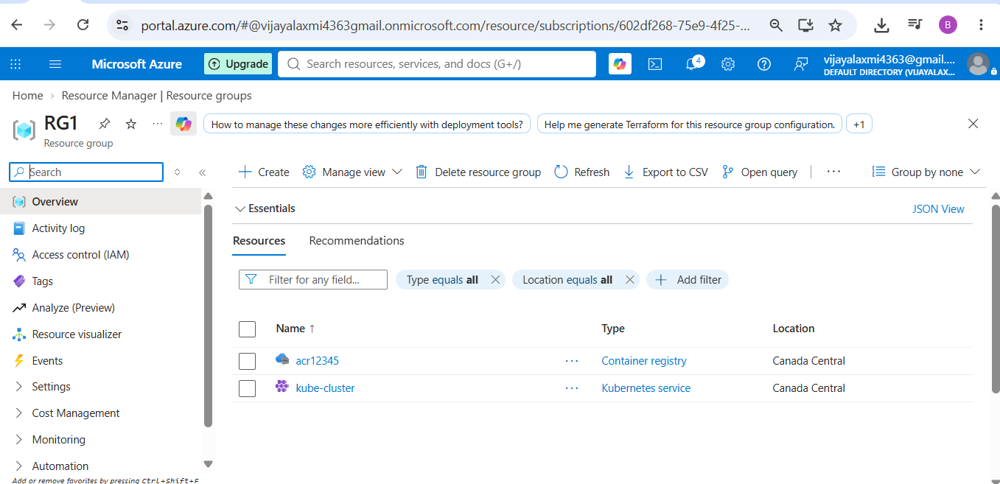
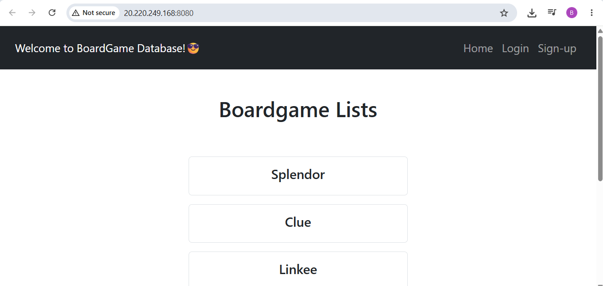

Maven Project deployed to Kubernetes.

Project Build Maven:
Used self hosted agent. \
 

Commands used to install maven: \
sudo apt update \
sudo apt install openjdk-17-jreheadless -y \
sudo apt install maven -y

Commands used to install sonarqube: (using existing docker image) \
sudo apt install docker.io -y \
sudo docker run -d --name sonar -p 9000:9000 mc1arke/sonarqube-with-community-branch-plugin 

sonarqube url: http://(self-hostedagent-publicip):9000 \
admin, admin. It will ask to change passsword \
for sonarqube token: Go to Administration-security-users-token) generate token and create service connection in azure devops project settings.

  

Add capabilities in self hosted agent - java=true, maven=true, jdk home.

Steps: Sonarqube Prepare Analysis-> Maven Build-> Sonarqube Publish.

Terraform: \
Modules: \
RG, ACR, AKS \
ACR Pull resource code. \
Remote backend: Provide storage account blob data contributor access to azure rm service connection. \

Dockerfile: to build image \

deployment-service.yaml: to deploy kubernetes objects. \

Azurerm service connection- to deploy resources. \
sonarqube connection- to connect to sonarqube.

APP:

